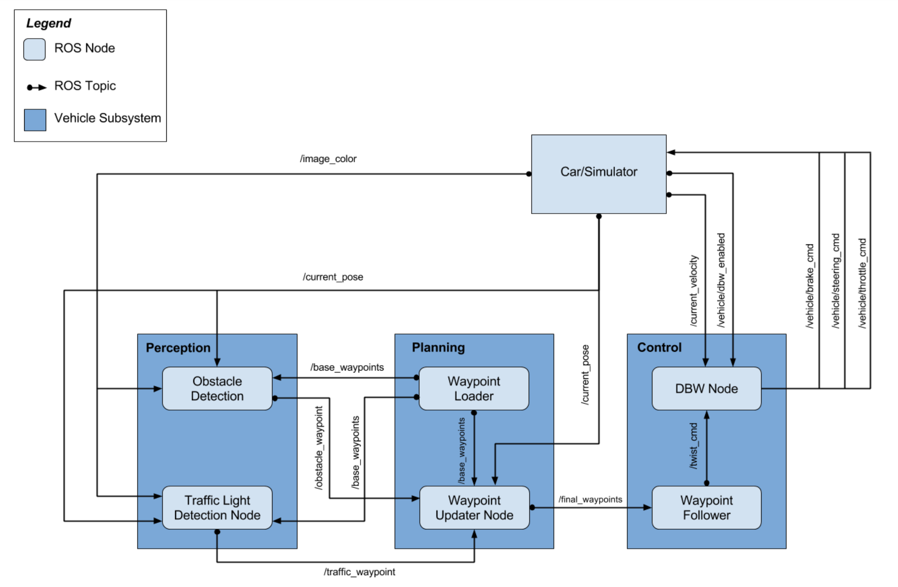
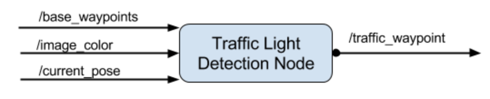

# CarND-Capstone-Project-ROS
Self-Driving Car Engineer Nanodegree Program
[](http://www.udacity.com/drive)


## Abstract
The goal is to enable the self driving car driving around the test track using waypoint navigation and stopping on traffic lights. 
Every of this waypoints gets the x,y - coordinates of the track and a spesific target velocity, tepending on the traffic light.
The Controll - System uses the thorttle, steering and brakes to succesfully navigate the
waypoints with in the correct target velocity.<br> 
In this project are componets of
- Perception 
- Planning 
- Controlling 
are implemented.

In the Perception part are traffic ligh detection integreated. In the further also object detection can be integreated. 
The nessecary infastructure is there. But wasnt on the scope of this project.

In the planning a node is intruduced, **wasypoint updater**. This node sets the target velocity 
for each wapoint based on the traffic light situation. Since there are no objects around the track. 
So if a traffic ligh is comming up in horizen the waypoint that leading to that traffic light getting 
deaccelerated.

In the control sup system is a drive by wire node implemented. That takes target trajectories inforamtion
as input and sens, control commands to navigate the vehicle.

A ros framework that works with [Autoware](https://github.com/Autoware-AI/autoware.ai)
and an simulator is provided by udacity. So that the focus 
is the abow topics.

Watch here the Planner in [action](https://youtu.be/qC0Bk1E7Hy8W).

Overview
---
1. System Architecture
2. Prediction 
3. Behavior Planner
4. Trajectory Planner
5. Appendix: *Build Instructions & Simulator* ...

## Intro Behavior Planner
The following system architecute diagm showing the ROS nodes and topic used in this project. 
The ROS topics show in the diagarm are desrcibed briefly in the **Code Structure** section below, and 
more detail is provieded later. 

<figure>
 
 <figcaption>
 <p></p> 
 <p style="text-align: center;"> Fig. 1: System achitecture. </p> 
 </figcaption>
</figure>
 <p></p>

## Perception
In the perception part traffic ligh detection is integreated. So the infrastructure (Node) is implmented and the light inforamtion read in from the simulator. 

<figure>
 
 <figcaption>
 <p></p> 
 <p style="text-align: center;"> Fig. 2: Traffic Light Detection Node. </p> 
 </figcaption>
</figure>
 <p></p>


To enhance the project further a traffic ligh classifyer can be trained an integreaed, simlar to my 
project traffic sign classifyer. Also an object detection could be integreated. 
The nessecary infastructure is already there. But that wasnt on the scope of this project.

## Appendix
Please use **one** of the two installation options, either native **or** docker installation.

### Native Installation

* Be sure that your workstation is running Ubuntu 16.04 Xenial Xerus or Ubuntu 14.04 Trusty Tahir. [Ubuntu downloads can be found here](https://www.ubuntu.com/download/desktop).
* If using a Virtual Machine to install Ubuntu, use the following configuration as minimum:
  * 2 CPU
  * 2 GB system memory
  * 25 GB of free hard drive space

  The Udacity provided virtual machine has ROS and Dataspeed DBW already installed, so you can skip the next two steps if you are using this.

* Follow these instructions to install ROS
  * [ROS Kinetic](http://wiki.ros.org/kinetic/Installation/Ubuntu) if you have Ubuntu 16.04.
  * [ROS Indigo](http://wiki.ros.org/indigo/Installation/Ubuntu) if you have Ubuntu 14.04.
* Download the [Udacity Simulator](https://github.com/udacity/CarND-Capstone/releases).

### Docker Installation
[Install Docker](https://docs.docker.com/engine/installation/)

Build the docker container
```bash
docker build . -t capstone
```

Run the docker file
```bash
docker run -p 4567:4567 -v $PWD:/capstone -v /tmp/log:/root/.ros/ --rm -it capstone
```

### Port Forwarding
To set up port forwarding, please refer to the "uWebSocketIO Starter Guide" found in the classroom (see Extended Kalman Filter Project lesson).

### Usage

1. Clone the project repository
```bash
git clone https://github.com/udacity/CarND-Capstone.git
```

2. Install python dependencies
```bash
cd CarND-Capstone
pip install -r requirements.txt
```
3. Make and run styx
```bash
cd ros
catkin_make
source devel/setup.sh
find /home/workspace/your/directory -type f -iname "*.py" -exec chmod +x {} \;
roslaunch launch/styx.launch
```
4. Run the simulator

### Real world testing
1. Download [training bag](https://s3-us-west-1.amazonaws.com/udacity-selfdrivingcar/traffic_light_bag_file.zip) that was recorded on the Udacity self-driving car.
2. Unzip the file
```bash
unzip traffic_light_bag_file.zip
```
3. Play the bag file
```bash
rosbag play -l traffic_light_bag_file/traffic_light_training.bag
```
4. Launch your project in site mode
```bash
cd CarND-Capstone/ros
roslaunch launch/site.launch
```
5. Confirm that traffic light detection works on real life images

### Other library/driver information
Outside of `requirements.txt`, here is information on other driver/library versions used in the simulator and Carla:

Specific to these libraries, the simulator grader and Carla use the following:

|        | Simulator | Carla  |
| :-----------: |:-------------:| :-----:|
| Nvidia driver | 384.130 | 384.130 |
| CUDA | 8.0.61 | 8.0.61 |
| cuDNN | 6.0.21 | 6.0.21 |
| TensorRT | N/A | N/A |
| OpenCV | 3.2.0-dev | 2.4.8 |
| OpenMP | N/A | N/A |

We are working on a fix to line up the OpenCV versions between the two.
